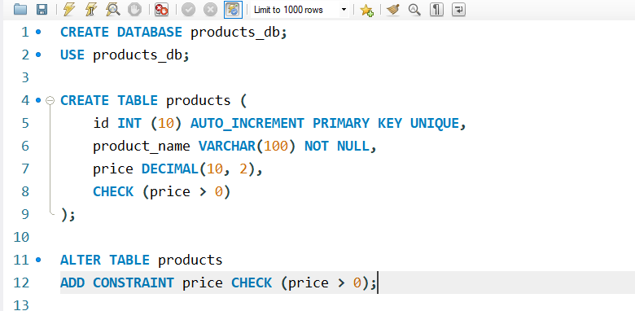

# **FINAL LAB TASK 3**-* Table Manipulation*

###  Step 1: Create the Products table 

  

## Step 2: Check Price greater 0

  

## Step 3: Insert products

  

## Step 4 : Modify product_name length of 120 char

  

## ER Diagram or Relational Schema

  

-Final task 3: <a href=https://github.com/Mathewski77/EDM-Portfolio_Mathew/tree/main/FINAL%20TASK%203/sql%20database%20task%203> sql copy of the database and table structures </a>

