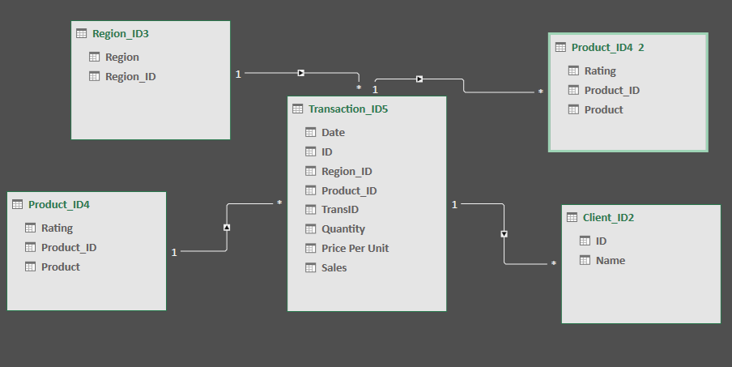

### <ins>Midterm Lab Task 1 - Data Cleaning and Preparation using Excel<ins>
For this task we are given a Flat data from Excel (See rawfile) and we are Task to perform Data CLeaning and Preparation

### STEP 1 Data Cleaning process

-Load the raw file  
-Fit Column and row width and height  
-TRIM extra spaces  
-Remove NULL values  
-Remove Duplicates  

### STEP 2 Normalization

-Performed 1NF  
-Perform Table split using 2NF  
-Perform 3 NF  
-Mapped the Normalized tables as a Physical Data Model  

### STEP 3 Here's the screenshot of my output before I started data cleaning (See screenshot)

  

### STEP 4 Here's the screenshot of my output after I started data cleaning (See screenshot)

  

### STEP 5 Here's the screenshot of my Data Model/Relationship

  

