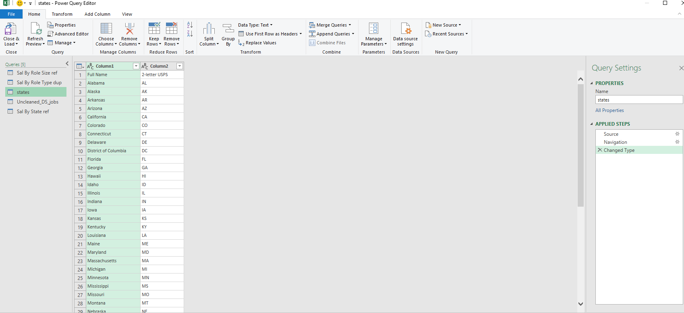

### <ins>Midterm Lab Task 2 - Data Cleaning and Transformation Using Power Query Editor<ins>
Company X would like to extract some useful information from the UnclenedDSJObs csv taken
from a Job Posting site available in Kaggle. There are a lot of columns available but focus only
on generating insights that will answer the ff:

### Here are your data-cleaning task:

A. LSalary Estimate Column – Remove All the characters after the ( openparentheses) by GOING to
B. Create 2 New Columns (From the Salary Estimate) Min Sal and Max Sal  
C. ADD COLUMN – Role Type  
D. SPLIT COLUMNS by Delimeter  
E. Select Location column (SPLIT columns by , Delimeter)  
F. Copy the APPLIED steps as proof of your Data Cleaning Activities

### Part 2. Reshape and Group the tables:
A. Create a duplicate of the raw data Right Click Unclean DS Jobs select
duplicate (Queries pane)
B.Rename the duplicate with “Sal By Role Type dup”
C. Create a reference of the raw data Right Click Unclean DS Jobs
choose reference (Queries pane)
D. Rename the reference with “Sal By Role Size ref”
E. Mapping Other Files and include in the current queries
F. Create a reference of the raw data Right Click Unclean DS Jobs
choose reference (Queries pane)
G. Rename the reference with “Sal By State ref”

### Here's the screenshot of my output before I started data cleaning (See screenshot)

  

### Here's the screenshot of my output after I started data cleaning (See screenshot)

  

### Here's the screenshot of my output SAL BY ROLE SIZE (See screenshot)

  

### Here's the screenshot of my output SAL BY ROLE TYPE (See screenshot)

  

### Here's the screenshot of my output SAL BY STATE.PNG (See screenshot)

  

### Here's the screenshot of my output SAL ROLE BY SIZE (See screenshot)

  

### Here's the screenshot of my output STATES (See screenshot)

  

Proof of Data Cleaning Activities: <a href=https://github.com/Mathewski77/EDM-Portfolio_Mathew/blob/main/Midterm%20task%202/Advanced%20Editor%20Part%201> Data Cleaning Activities </a> 
