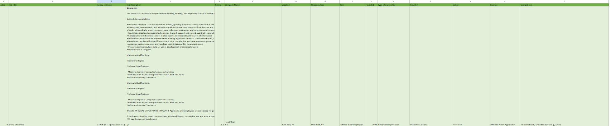
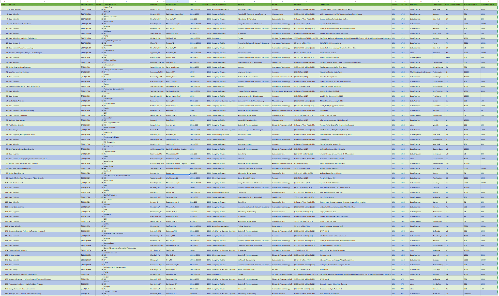

### <ins>Midterm Lab Task 2 - Data Cleaning and Transformation Using Power Query Editor<ins>
Company X would like to extract some useful information from the UnclenedDSJObs csv taken
from a Job Posting site available in Kaggle. There are a lot of columns available but focus only
on generating insights that will answer the ff:

### Here are your data-cleaning task:

A. LSalary Estimate Column – Remove All the characters after the ( openparentheses) by GOING to
B. Create 2 New Columns (From the Salary Estimate) Min Sal and Max Sal  
C. ADD COLUMN – Role Type  
D. SPLIT COLUMNS by Delimeter  
E. Select Location column (SPLIT columns by , Delimeter)  
F. Copy the APPLIED steps as proof of your Data Cleaning Activities

### Here's the screenshot of my output before I started data cleaning (See screenshot)

  

### Here's the screenshot of my output after I started data cleaning (See screenshot)

  

Midterm Lab Task1: <a href=https://github.com/Mathewski77/EDM-Portfolio_Mathew/blob/main/Midterm%20task%202/Advanced%20Editor%20Part%201> Data Cleaning and Preperation using EXCEL </a> 
